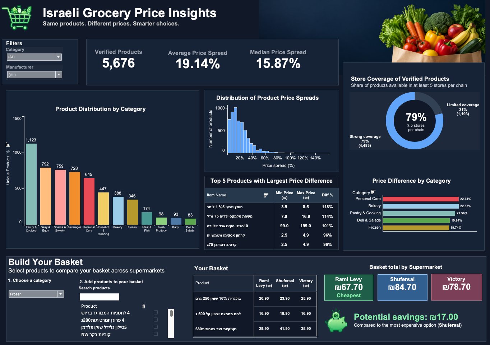
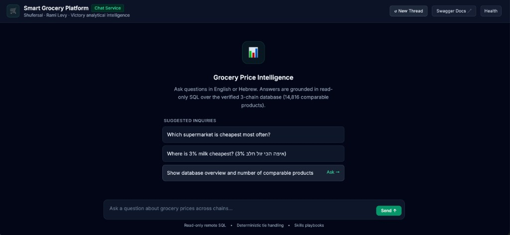

# Smart Grocery Platform

**Same milk. Same pasta. Three Israeli supermarkets. Three different prices.**

Shufersal, Rami Levy, and Victory often sell the **same product** (same
barcode on the same pack). The price is still not the same. Comparing
by hand is slow. Comparing badly is worse: a “cheapest chain” number
is useless if you mixed a 1-pack with a 12-pack, or a wholesale
Cash&Carry price with what a supermarket shopper actually pays.

This project turns official chain price files into **two products** you
can use.

---

## The problem

| Pain | What goes wrong |
|---|---|
| Prices move by chain and by store | One expensive branch should not define a whole supermarket |
| Thousands of overlapping products | Nobody will compare them in a spreadsheet for fun |
| Barcodes look identical | They are not always the same thing on the shelf |
| “Where should I shop this week?” | The answer depends on **your** basket, not a national slogan |

---

## Two products

### 1. Israeli Grocery Price Insights (dashboard)

An interactive Tableau view of **5,676** products that appear in all
three chains **and** pass a like-for-like check.

- Filter by category or manufacturer
- See how wide the price gap is (average spread **19.14%**)
- **Build your own basket:** pick products you actually buy; the
  dashboard totals each chain and highlights the cheapest

**[Open the live dashboard on Tableau Public](https://public.tableau.com/app/profile/liza.benguerchon4043/viz/shared/X76QXF9GS)**
— no install. Filter, click around, add items to a basket.



*Example session: a custom frozen basket — Rami Levy cheapest,
potential saving ₪17 vs Shufersal.*

Want a fixed example without opening Tableau? A documented 13-item
household shop (milk, eggs, bread, rice, pasta, produce, yogurt, soap,
toilet paper, tuna, lentils) comes to **Rami Levy ₪193.70**, Shufersal
₪203.00, Victory ₪210.00. Potatoes and chicken are left out when the
chains do not sell a matching item.
[Full table](docs/weekly_basket_results.md).

### 2. Grocery chat (plain-language Q&A)

**Grocery Price Intelligence** is a local web chat over the same
analytical database. Ask in English or Hebrew. Suggested prompts are
on the home screen. Answers come from **named, read-only SQL** over
the comparable catalog (14,816 products) — the service cannot invent
queries or write to the database.



*Home screen: suggested questions, bilingual 3% milk prompt, Swagger
and Health links in the header. Footer: read-only remote SQL,
deterministic ties, skill playbooks.*

Try questions like:

- Which supermarket is cheapest most often?
- Where is 3% milk cheapest? / איפה הכי זול חלב 3%?
- Show database overview and number of comparable products

**Run it with uv** (needs `REMOTE_DB_*` and a model key in `.env`):

```bash
uv run python -m src.agent_platform
```

Or in Cursor: **Run and Debug → Chat Service**. That runs the same
`uv run python -m src.agent_platform` command and opens
[http://127.0.0.1:8000/](http://127.0.0.1:8000/) in your browser when
Uvicorn is ready.

How it works: [docs/agent_platform.md](docs/agent_platform.md).

---

## Try it yourself

**Fastest (no install):**
[open the dashboard on Tableau Public](https://public.tableau.com/app/profile/liza.benguerchon4043/viz/shared/X76QXF9GS).
Then skim the [13-item basket](docs/weekly_basket_results.md) or the
[comparability audit](docs/comparability_audit.md) if you want to know
why 5,676 products made the cut and 732 three-chain barcodes did not.

**Chat in a browser** (Python 3.11, [uv](https://docs.astral.sh/uv/),
remote database settings in `.env`):

```bash
git clone https://github.com/lizabguercho/smart-grocery-platform.git
cd smart-grocery-platform
uv sync
cp .env.example .env
# add REMOTE_DB_* and OPENAI_API_KEY (or another model key)
uv run python -m src.agent_platform
```

Then open **http://127.0.0.1:8000/**, or skip the last command and use
**Run and Debug → Chat Service** in Cursor (same `uv` command; the
browser opens when the server is up).

**Rebuild the warehouse** from official PriceFull files (local
PostgreSQL): follow [docs/getting-started.md](docs/getting-started.md).
That path is for people who want to reproduce the analysis, not for a
first look.

Snapshot behind both products: PriceFull **19 August 2026**, audit
**9 September 2026** — not a live store quote.

| Catalog | Count |
|---|---|
| Same barcode in at least two chains | **14,816** |
| Same barcode in all three | **6,408** |
| Like-for-like after audit (dashboard) | **5,676** (88.6%) |

---

## How the numbers stay honest

- Official **PriceFull** files only (no scraped websites).
- A chain price is the **middle (median)** store price that day.
- If two chains share the lowest price, that is a **tie**.
- Dashboard headlines use audit-**valid** rows only. A large % gap is
  kept when the packs still match.
- Categories come from SuperCompare plus a documented model
  ([experiments](docs/product_classifier_experiments.md)); unlabeled
  leftovers are not treated as gold.

More: [docs/project-roadmap.md](docs/project-roadmap.md) ·
[docs/README.md](docs/README.md)

---

## Stack

Python 3.11 · PostgreSQL · SQL · Tableau · FastAPI · pandas ·
scikit-learn · uv

---

## Author

**Liza Benguerchon** — ETL, SQL admin, data analysis and data science  
**Samuel Benguerchon** - AI Engineering and data science

Built so you can **see** where groceries are cheaper, **ask** the data
in plain language, and **check** the method.
