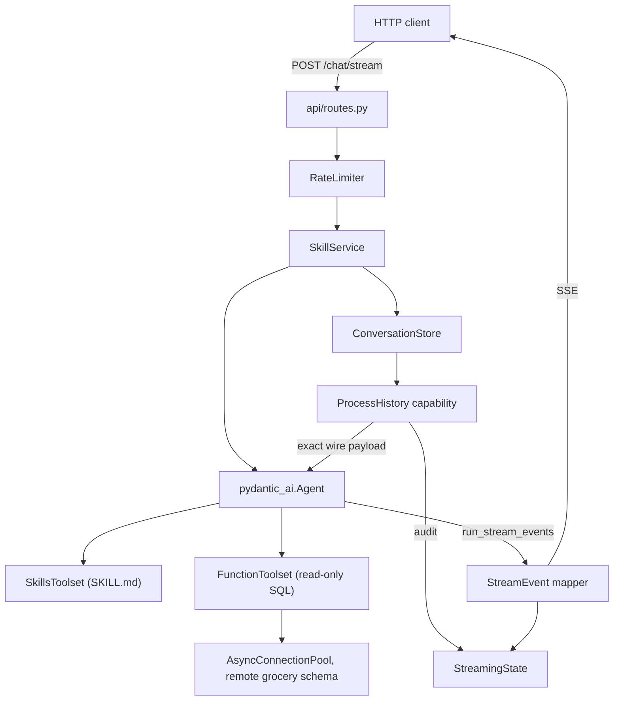
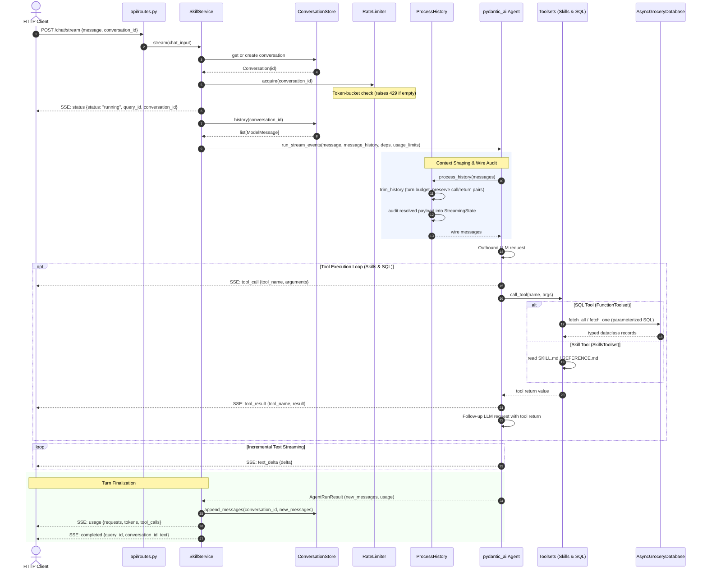

# Agent platform chat service

Related: [Documentation map](README.md) ·
[ADR 0007 — chat service](adr/0007-agent-platform-chat-service.md) ·
[Remote database](remote_database_architecture.md) ·
[Client-server architecture](client-server-architecture.md)

Ask grocery price questions in plain language and get answers from the shared
analytical database. This is the *how to run and how it works* document; the
*why* is in [ADR 0007](adr/0007-agent-platform-chat-service.md).

## Running it

Add the agent settings to `.env` (see `.env.example`). The chat service reads
the **remote** analytical database, so `REMOTE_DB_*` must be filled in:

```text
AGENT_MODEL=openai:gpt-5.2
OPENAI_API_KEY=sk-...
```

`AGENT_MODEL` is a pydantic-ai model string, `<provider>:<model>`, so any
supported provider works by changing this one variable and supplying its key
(`ANTHROPIC_API_KEY`, `GOOGLE_API_KEY`, and so on). Note that the `openai:`
prefix resolves to the Responses API; use `openai-chat:` for Chat Completions.

Then:

```bash
uv run python -m src.agent_platform
```

The service listens on `http://127.0.0.1:8000`. Visiting the root URL (`/` or
`/ui`) in a browser opens the interactive Web Chat UI. Interactive API docs are
at `/docs`.

```bash
curl -s http://127.0.0.1:8000/health

curl -N -X POST http://127.0.0.1:8000/chat/stream \
  -H 'Content-Type: application/json' \
  -d '{"message": "Which supermarket is cheapest most often?"}'
```

If the model is not configured, the stream still opens and then reports a
typed error naming the missing variable, rather than failing opaquely.

## Endpoints

| Method | Path | Purpose |
|---|---|---|
| `GET` | `/` or `/ui` | Interactive Web Chat UI for browser testing |
| `POST` | `/chat/stream` | Ask a question, receive SSE events as they happen |
| `POST` | `/chat` | Ask a question, receive the complete answer |
| `GET` | `/health` | Liveness, resolved model, loaded skills |
| `GET` | `/skills` | The skill playbooks the agent can load |
| `GET` | `/conversations/{id}/context` | Exactly what a next turn would send the model |
| `GET` | `/docs` | Interactive Swagger UI / OpenAPI specification |

Continue a conversation by passing the `conversation_id` from the first event
back in the next request.

## Streamed events

Each SSE message carries its type in the `event` field and JSON in `data`, so a
client can dispatch without parsing the body first.

| Event | Carries |
|---|---|
| `status` | Lifecycle status, plus `query_id` and `conversation_id` |
| `tool_call` | Which tool the model called, with its arguments |
| `tool_result` | What the tool returned to the model |
| `text_delta` | An incremental piece of the answer |
| `usage` | Requests, tool calls and token counts |
| `completed` | Terminal success, with the full answer |
| `error` | Terminal failure, with a code and message |

Exactly one of `completed` or `error` ends every stream, so a client never has
to infer failure from a dropped connection. The first event is always `status`,
which is how a client learns the conversation id even if the run then fails.

## How a question is answered



## Lifecycle of a conversation turn

Every chat turn progresses through request resolution, rate limiting, context
shaping, model reasoning, tool execution, and stream completion:



The agent has two kinds of capability, and the distinction matters:

**Skills are documentation.** A skill is a `SKILL.md` playbook in
`src/agent_platform/skills/`. It tells the model which tools to combine, in
what order, and which caveats to state. The model loads one on demand.

| Skill | Use |
|---|---|
| `grocery-database` | Schema, trustworthy tables, data limitations (ships `REFERENCE.md`) |
| `price-comparison` | One named product: resolve the name to a barcode, then compare |
| `chain-competitiveness` | Chain-wide or category-wide questions, ties and availability bias |

**Tools do the work.** Five read-only SQL tools, each running one named
statement from `grocery/queries.py`:

| Tool | Answers |
|---|---|
| `find_products` | The `item_code` for a product name (names are in Hebrew) |
| `compare_product_prices` | Each chain's price for one barcode, and the saving |
| `cheapest_chain_summary` | How often each chain is cheapest, ties separated |
| `category_price_summary` | Chain competitiveness within a category |
| `database_overview` | Row counts and available categories |

## Controlling the context

The requirement is to know at any moment exactly what the model was fed.

`ProcessHistory` in `chat_service/context.py` runs immediately before every
model request, and pydantic-ai sends exactly what it returns. That makes it
both the single control point and the single observation point. Every resolved
payload is appended to `StreamingState.model_requests` as a
`ModelRequestAudit`, and `GET /conversations/{id}/context` serializes stored
history through `ModelMessagesTypeAdapter`.

Trimming is governed by `AGENT_HISTORY_MAX_MESSAGES` and
`AGENT_HISTORY_MAX_CHARS`, and works on **whole conversation turns**. A turn
starts at a user prompt and runs to the next one, which is the only cut that
cannot separate a tool call from its result. Splitting that pair would produce
a request providers reject. The most recent turn is always kept, even if it
alone exceeds the budget.

Characters are a deliberately crude proxy for tokens: no tokenizer, no network
call, and the budget only has to bound the context. The real token ceiling is
enforced by `UsageLimits`.

## Limits

Two limits answer different questions and are configured separately.

**How often may a run start?** A token bucket per conversation,
`AGENT_RATE_LIMIT_REQUESTS_PER_MINUTE` and `AGENT_RATE_LIMIT_BURST`. Rejection
is immediate and carries a `Retry-After`, so a caller backs off instead of
accumulating hidden latency.

**What may a started run consume?** `AGENT_REQUEST_LIMIT`,
`AGENT_TOOL_CALLS_LIMIT` and `AGENT_TOTAL_TOKENS_LIMIT`, enforced by
pydantic-ai and surfaced as a `usage_limit_exceeded` error.

## Safety

The agent cannot write to the database and cannot compose SQL.

- No free-form SQL tool exists. Every statement is a named constant with `%s`
  parameters, so an injected instruction in a product name cannot become a
  query.
- The connection sets `default_transaction_read_only=on` and
  `statement_timeout` as server-side session options, so writes and unbounded
  scans fail at the database, not merely in application code.
- `run_skill_script` is excluded from the skills toolset, so no file in a skill
  directory can be executed.
- Database errors are wrapped before they reach a client, because driver
  messages can echo the connection string.

## Known limitations

Category answers are limited by data, not code. `grocery.product_classification`
is empty until the SuperCompare promotion step runs, so
`category_price_summary` returns an explicit note rather than an empty result.

Prices are per-chain medians across that chain's stores, not shelf prices at a
branch, and the analytical layer is a snapshot rather than a time series, so
questions about price changes over time cannot be answered.

Only products sharing an exact barcode across at least two chains are
comparable: 14,816 products, of which 6,435 are stocked by all three chains.

Conversations are held in memory and lost on restart. The service depends on
the `ConversationStore` protocol, so a Postgres-backed store can replace
`InMemoryConversationStore` without changes elsewhere.

## Layout

```text
src/agent_platform/
├── __main__.py            uvicorn entrypoint
├── config.py              AgentPlatformConfig.from_env, named constants
├── errors.py              ErrorCode, ChatServiceError hierarchy, wire payload
├── instruction.py         system instructions for the analyst model
├── rate_limit.py          token bucket with an injected clock
├── api/                   FastAPI app factory and routes
├── chat_service/
│   ├── models.py          Pydantic at the HTTP boundary, dataclasses inside
│   ├── streaming.py       StreamEvent union and StreamingState
│   ├── context.py         ProcessHistory: trimming and auditing
│   ├── conversations.py   ConversationStore protocol and in-memory store
│   ├── instruction.py     re-export of agent instructions
│   ├── service.py         request to agent-request translation
│   └── skill_service.py   agent construction and event streaming
├── grocery/
│   ├── queries.py         every SQL statement, as a named constant
│   ├── database.py        read-only async connection pool
│   ├── grocery_toolset.py the five tools
│   ├── records.py         dataclasses the tools return
│   └── chains.py          chain identity across the analytical tables
└── skills/                SKILL.md playbooks
```

## Tests

```bash
uv run pytest test/unit
```

Tests use `TestModel` instead of a provider and a fake database instead of a
connection, so they need no API key, no network and no live database. The
rate limiter is driven by a fake clock, so nothing sleeps.
