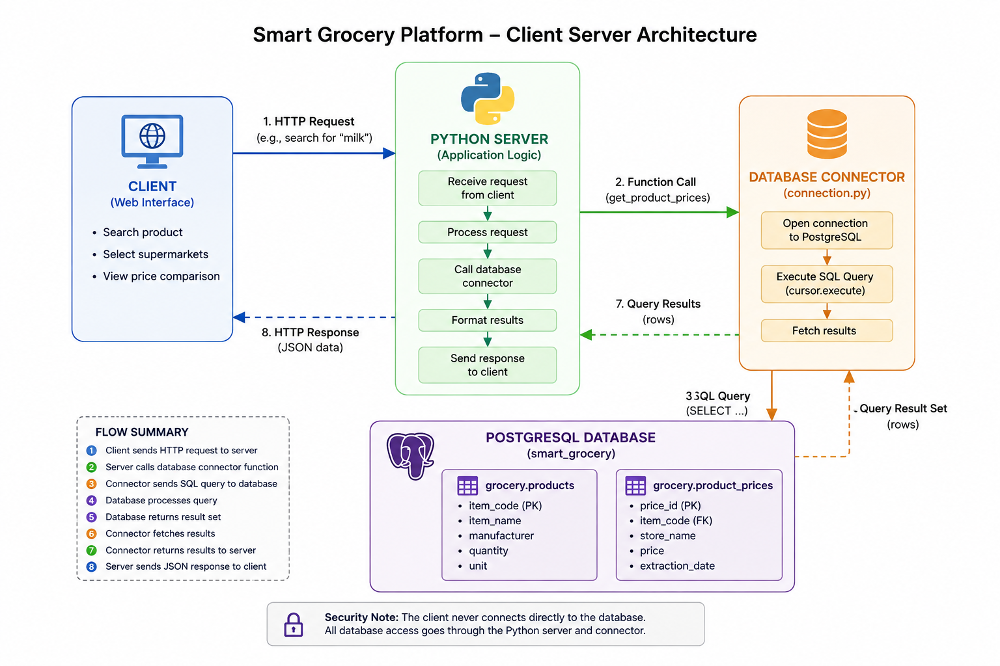

# Database Connection Architecture

## Overview

The Smart Grocery Platform uses a client-server architecture to connect the Python application to a PostgreSQL database.

In this architecture:

* The Python application is the **client**.
* PostgreSQL is the **database server**.
* The database connector is responsible for establishing communication between them.

The client sends SQL requests to the PostgreSQL server, and the server processes those requests and returns the results.


## Client–Server Architecture




## Components

### Python Client

The Python code acts as the database client.

It may need to:

* Insert extracted supermarket data.
* Read product and price information.
* Update existing records.
* Run data-quality checks.
* Retrieve data for future analysis or dashboards.

The application should not create a separate database connection inside every function. Instead, the connection logic is kept in a dedicated database module.

### Database Connector

The database connector provides the communication layer between Python and PostgreSQL.

The connector receives database configuration values such as:

* Database host
* Database port
* Database name
* Username
* Password

It then opens a connection to the PostgreSQL server.

In this project, the connection logic is stored in:

```text
src/database/connection.py
```

Keeping the connection logic in one module makes the code easier to maintain and prevents database credentials and connection code from being repeated throughout the project.

### PostgreSQL Server

PostgreSQL is the server responsible for storing and managing the grocery data.

The server:

* Accepts connections from authorized clients.
* Receives SQL queries.
* Validates and executes the queries.
* Stores or retrieves data.
* Returns results or error messages to the client.
* Manages transactions, constraints, indexes, and relationships between tables.

The PostgreSQL server can run locally on a developer's computer or remotely on a hosted database service.

## Connection Flow

The database connection follows these steps:

1. The Python application loads the database configuration from environment variables.
2. The application calls the database connection function.
3. The connector sends a connection request to PostgreSQL.
4. PostgreSQL verifies the provided credentials.
5. If the credentials are valid, PostgreSQL creates a database session.
6. The Python application sends SQL queries through this session.
7. PostgreSQL executes the queries and returns the results.
8. The application commits or rolls back the transaction.
9. The connection is closed when it is no longer needed.

## Environment Variables

Database credentials must not be written directly inside the Python code.

They are stored in a local `.env` file, for example:

```text
DB_HOST=localhost
DB_PORT=5432
DB_NAME=smart_grocery
DB_USER=postgres
DB_PASSWORD=your_password
```

The `.env` file is included in `.gitignore` so that sensitive credentials are not uploaded to GitHub.

A separate `.env.example` file can be committed to the repository to show collaborators which variables they need to define:

```text
DB_HOST=
DB_PORT=5432
DB_NAME=
DB_USER=
DB_PASSWORD=
```

## Connection Module

A simplified connection module can look like this:

```python
import os

import psycopg
from dotenv import load_dotenv

load_dotenv()


def get_connection() -> psycopg.Connection:
    return psycopg.connect(
        host=os.getenv("DB_HOST"),
        port=os.getenv("DB_PORT"),
        dbname=os.getenv("DB_NAME"),
        user=os.getenv("DB_USER"),
        password=os.getenv("DB_PASSWORD"),
    )
```

Other modules can import and use this function:

```python
from database.connection import get_connection


with get_connection() as connection:
    with connection.cursor() as cursor:
        cursor.execute("SELECT COUNT(*) FROM grocery.products;")
        product_count = cursor.fetchone()[0]

print(product_count)
```

## Transactions

A transaction groups one or more database operations into a single unit of work.

When data is inserted or updated:

* `commit` permanently saves the changes.
* `rollback` cancels the changes if an error occurs.

Using a context manager helps manage transactions safely:

```python
with get_connection() as connection:
    with connection.cursor() as cursor:
        cursor.execute(
            """
            INSERT INTO grocery.products (item_code, item_name)
            VALUES (%s, %s)
            """,
            ("12345", "Example product"),
        )
```

If the operation succeeds, the transaction is committed. If an exception occurs, the transaction is rolled back.

## Parameterized Queries

Values should be passed separately from the SQL query:

```python
cursor.execute(
    """
    SELECT item_name
    FROM grocery.products
    WHERE item_code = %s
    """,
    (item_code,),
)
```

Values should not be inserted into SQL using string formatting or f-strings.

Parameterized queries:

* Reduce the risk of SQL injection.
* Handle escaping correctly.
* Make queries safer and more reliable.

## Local Development Architecture

During local development, both the Python client and PostgreSQL server may run on the same computer:

```text
Developer's Computer
├── Python Application
│   └── Database Connector
└── Local PostgreSQL Server
    └── smart_grocery Database
```

In this case, the database host is usually:

```text
localhost
```

Even though both components run on the same computer, they still follow a client-server architecture. Python connects to PostgreSQL through a network port, normally port `5432`.

## Shared Database Architecture

When multiple collaborators need access to the same database, PostgreSQL can be hosted remotely:

```text
Developer A Python Client
            \
             \
              > Hosted PostgreSQL Server
             /
Developer B Python Client
```

Each collaborator runs the Python application locally but connects to the same PostgreSQL server using their own environment variables.

The database password must be shared securely and must never be committed to Git.

## Separation of Responsibilities

The architecture separates responsibilities between the application and the database.

The Python application is responsible for:

* Downloading source files.
* Parsing XML data.
* Cleaning and transforming values.
* Preparing database records.
* Sending SQL operations.

PostgreSQL is responsible for:

* Persisting the data.
* Enforcing primary and foreign keys.
* Preventing invalid or duplicate records.
* Managing transactions.
* Running queries efficiently.
* Providing data to analysis and dashboard components.

This separation makes the project easier to test, maintain, and extend.

## Error Handling

The application should handle connection and query errors clearly.

Possible errors include:

* PostgreSQL is not running.
* The host or port is incorrect.
* The username or password is incorrect.
* The requested database does not exist.
* A SQL query violates a database constraint.
* The network connection is unavailable.

Errors should be logged or reported with enough information to identify the problem, while passwords and other sensitive credentials must never be displayed.

## Summary

The Smart Grocery Platform uses Python as the database client and PostgreSQL as the database server.

The dedicated database connector:

* Loads configuration from environment variables.
* Opens the connection.
* Allows Python to send SQL queries.
* Supports transactions and error handling.
* Keeps database logic separated from extraction and transformation logic.

This architecture provides a secure and maintainable foundation for loading, storing, and analyzing supermarket product and price data.
