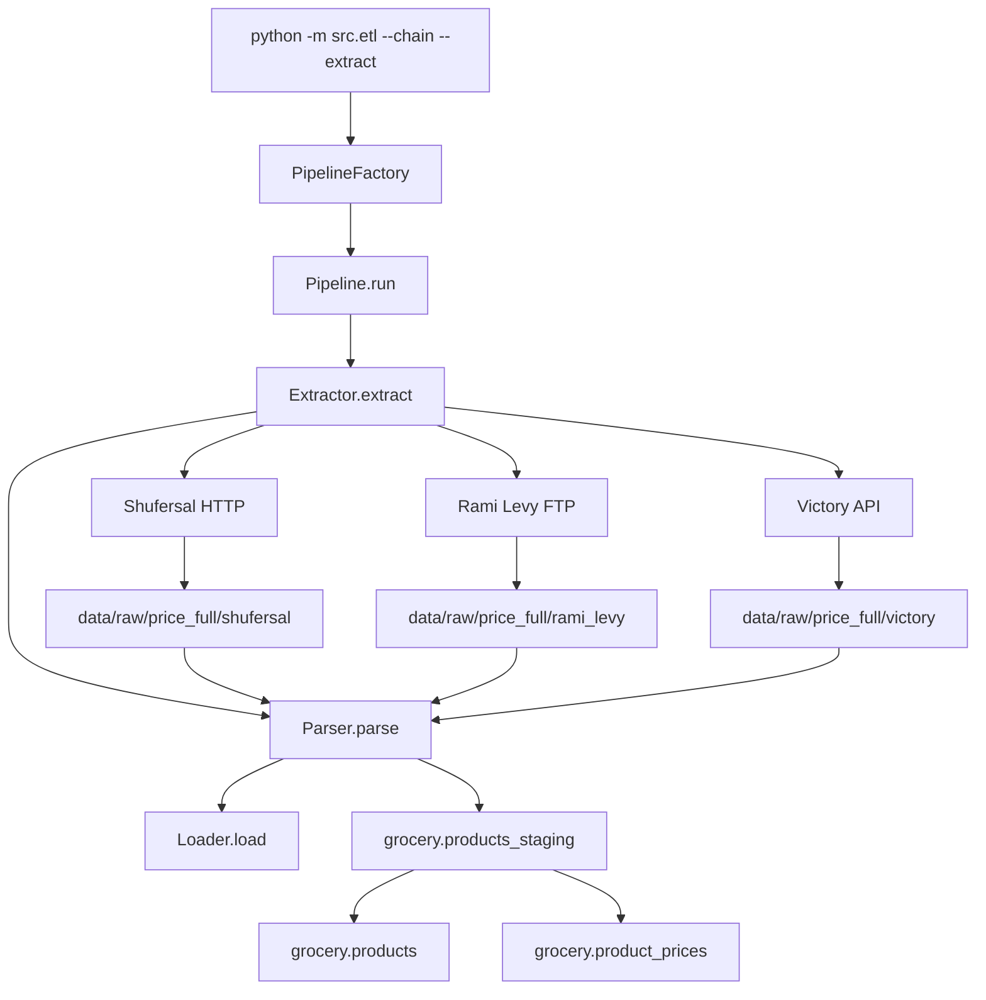

# ETL Pipeline

Related: [Documentation map](README.md) ·
[Process flow](etl-process-flow.md) ·
[ADR 0001](adr/0001-etl-pipeline-orchestration.md) ·
[ADR 0002](adr/0002-three-chains-and-extraction.md)

## Overview

The Smart Grocery Platform ETL downloads official supermarket files,
parses them into domain records, and loads them into PostgreSQL.

Every run is the same three steps:

```text
extract → parse → load
```

Callers choose a **chain** (`shufersal`, `rami_levy`, `victory`) and an
**extract type** (`prices_full`, `stores`, or `promo_full`). PriceFull,
Stores, and PromoFull are fully implemented for all three chains.

High-level PriceFull flow:

```text
Chain sources
→ chain-specific extract
→ shared XML parse (PriceFullProduct)
→ grocery.products_staging
→ grocery.products
→ grocery.product_prices
```

High-level PromoFull flow:

```text
Chain sources
→ chain-specific extract
→ shared XML parse (Promotion → PromotionGroup → PromotionItem)
→ grocery.promotions
→ grocery.promotion_groups
→ grocery.promotion_items
```


> Note: the image above is still Shufersal-era. Prefer the architecture
> diagram in this document until the PNG is regenerated.

The orchestration decision is recorded in
[ADR 0001](adr/0001-etl-pipeline-orchestration.md).
Why these three chains, and how files are extracted, is recorded in
[ADR 0002](adr/0002-three-chains-and-extraction.md).


## Architecture Principles

- **Pipeline:** `Pipeline` always runs extract → parse → load.
- **Strategy:** `Extractor`, `Parser`, and `Loader` are interchangeable.
- **Factory:** `PipelineFactory` wires the trio from `Chain` +
  `ExtractType` + `PipelineOptions`.
- **Chain-specific:** how files are downloaded or discovered.
- **Extract-type-specific:** how files are parsed and loaded.
- **CLI:** `uv run python -m src.etl --chain <chain> --extract <type>`


## How to run

From Cursor, use **Run and Debug → ETL Pipeline**. Dropdowns ask for
chain, dataset, and whether to download or reuse local files.

From the repository root:

```bash
uv run python -m src.etl --chain shufersal --extract prices_full --max-pages 2 --max-files 3
uv run python -m src.etl --chain rami_levy --extract prices_full --max-files 3
uv run python -m src.etl --chain victory --extract prices_full --no-download
uv run python -m src.etl --chain shufersal --extract stores
uv run python -m src.etl --chain victory --extract stores --max-files 3
uv run python -m src.etl --chain shufersal --extract promo_full --full
uv run python -m src.etl --chain rami_levy --extract promo_full --full
uv run python -m src.etl --chain victory --extract promo_full --full
```

| Flag | Meaning |
|------|---------|
| `--chain` | `shufersal`, `rami_levy`, or `victory` |
| `--extract` | `prices_full` (default), `stores`, or `promo_full` |
| `--max-files` | Download cap after latest-per-store selection (default `3`) |
| `--max-pages` | Shufersal listing-page cap (default `2`; ignored by other chains) |
| `--full` | No `max-files` or `max-pages` limit |
| `--download` / `--no-download` | Download sources, or use files already in `data/raw/price_full/<chain>/`, `data/raw/stores/<chain>/`, or `data/raw/promo_full/<chain>/` |


## Chain Extraction Methods

| Chain | Access method | Source | PriceFull directory | Stores directory | PromoFull directory |
|-------|---------------|--------|---------------------|------------------|---------------------|
| Shufersal | HTTP (HTML category pages → file links) | `prices.shufersal.co.il` | `data/raw/price_full/shufersal` | `data/raw/stores/shufersal` | `data/raw/promo_full/shufersal` |
| Rami Levy | FTP (Cerberus published prices) | `url.retail.publishedprices.co.il` | `data/raw/price_full/rami_levy` | `data/raw/stores/rami_levy` | `data/raw/promo_full/rami_levy` |
| Victory | HTTP JSON API + file download | `laibcatalog.co.il` | `data/raw/price_full/victory` | `data/raw/stores/victory` | `data/raw/promo_full/victory` |

Each extract type has its own raw directory. Existing local files can be skipped
on re-download. Downloaders keep one latest snapshot per store for the latest
available date.


## Shared Transform

All supported chains publish PriceFull XML with the same item schema.

- **Model:** `PriceFullProduct` and `FileMetadata` in
  `src/data_extraction/models.py`
- **Parser:** `PriceFullParser` wrapping `parse_price_full_files()` in
  `src/data_extraction/price_full_parser.py`

The parser opens each gzipped XML file, reads store/chain metadata from
the file root, and builds one `PriceFullProduct` per `<Item>`.


## Architecture Diagram




## Pipeline Steps

The `Pipeline` object always performs these three steps.

### 1. Extract

A chain `Extractor` downloads or locates files for the selected extract
type and returns local paths under `data/raw/price_full/<chain>/`,
`data/raw/stores/<chain>/`, or `data/raw/promo_full/<chain>/`.

### 2. Parse

A shared `Parser` for that extract type turns files into domain records
(`PriceFullProduct`, `Store`, or `Promotion`).

### 3. Load

A shared `Loader` for that extract type writes records to PostgreSQL.
CSV export is not part of the pipeline.

### PriceFull loader internals

`PriceFullLoader` still uses staging and validation. Those are loader
details, not extra pipeline steps:

1. Truncate and load `grocery.products_staging`
2. `validate_staging()`
3. Upsert `grocery.products`
4. Upsert `grocery.product_prices`
5. `validate_product_prices()`
6. Clear staging

**Staging decision:**  
The staging table represents only the current extraction and is not
used for historical storage.

`validate_staging()` rejects rows with NULL `item_code`, `store_id`,
`extraction_date`, or `item_price`.

Unique products are loaded from staging into `grocery.products`.
`item_code` is the primary key.

If a product does not exist, it is inserted. If it already exists, its
metadata is updated using the latest extraction.

**Products decision:**  
The `products` table represents the latest known product metadata.
Fields such as product name, manufacturer, quantity, and unit of measure
may change over time, so existing products are updated rather than ignored.

Historical prices are not stored here. Price history is preserved in
`grocery.product_prices`.

Price observations are loaded into `grocery.product_prices`.
A price record is uniquely identified by:

`chain_id + store_id + item_code + extraction_date`

**Same-day snapshot deduplication:**  
When staging contains multiple snapshots for the same key on the same
day, the loader uses:

```sql
SELECT DISTINCT ON (chain_id, store_id, item_code, extraction_date)
...
ORDER BY chain_id, store_id, item_code, extraction_date, source_file DESC
```

so one row per key is kept (latest `source_file` wins).

If the same key is loaded again later, `ON CONFLICT` updates the existing
row instead of inserting a duplicate.

**Prices decision:**  
Unlike the staging table, `product_prices` keeps historical observations
so prices can be analyzed over time.

`validate_product_prices()` checks that every price row references an
existing product (`item_code` foreign key relationship).

### PromoFull loader internals

`PromoFullLoader` upserts the three promotion tables directly. There is
no staging table and no separate validation step.

1. Skip promotions missing `chain_id`, `store_id`, or `promotion_id`
2. Upsert `grocery.promotions`
3. Upsert `grocery.promotion_groups` (skip a group with no `group_id`)
4. Upsert `grocery.promotion_items` (skip an item with no `item_code`)

XML shape (simplified):

```text
Root
  ChainID, SubChainID, StoreID, BikoretNo
  Promotions
    Promotion
      PromotionID, description, dates, club, restrictions, ...
      Groups
        Group
          GroupID, MinPurchaseAmount, DiscountType
          PromotionItems
            PromotionItem
              ItemCode, qty, discounted price, discount rate, ...
```

Each `<Promotion>` becomes one `grocery.promotions` row. Nested
`<Group>` and `<PromotionItem>` rows keep the parent promotion's
`chain_id`, `store_id`, `promotion_id`, and `extraction_date`.

**Promotions decision:**  
Unlike `grocery.stores` (latest-known metadata), promotions keep
history. `extraction_date` is part of every primary key, so a later
day inserts new rows instead of overwriting yesterday.

If the same promotion is loaded again for the same store and date,
`ON CONFLICT` updates the existing rows.

`promotion_items` has no foreign key to `grocery.products`. PromoFull
item codes are not guaranteed to exist in PriceFull, so the loader
keeps those rows instead of rejecting them.

**Known gap:** in the current dataset, 765 distinct promotion item
codes have no corresponding `grocery.products` row, primarily from
Rami Levy. Joins from `promotion_items` to `products` will drop those
codes unless the query treats the product side as optional.


## Data Flow

```text
grocery.products_staging
        |
        +----> grocery.products
        |
        +----> grocery.product_prices

grocery.promotions
        |
        +----> grocery.promotion_groups
                    |
                    +----> grocery.promotion_items
```


## Database Tables

### `grocery.products_staging`

Temporary landing table for the current extraction run. Truncated before
each load.

### `grocery.products`

One row per unique product (`item_code`). Holds the latest known product
metadata.

### `grocery.product_prices`

Historical price observations.

Primary key:

`(chain_id, store_id, item_code, extraction_date)`

### `grocery.stores`

Latest known metadata for one store in one chain. Re-runs update the
existing row. There is no store history table.

Primary key:

`(chain_id, store_id)`

### `grocery.promotions`

One promotion in one store on one extraction date. Holds description,
start/end times, club, coupon flags, remarks, and `source_file`.

Create the tables with `sql/02_create_tables.sql` before the first
PromoFull load.

Primary key:

`(chain_id, store_id, promotion_id, extraction_date)`

### `grocery.promotion_groups`

One group inside a promotion. A promotion can require more than one
group (for example buy-from-A and get-from-B). Group-level fields
`min_purchase_amount` and `discount_type` live here.

Primary key:

`(chain_id, store_id, promotion_id, group_id, extraction_date)`

Foreign key to `grocery.promotions` on
`(chain_id, store_id, promotion_id, extraction_date)`.

### `grocery.promotion_items`

Products mapped to a promotion group. Item-level reward fields live
here: `item_type`, `is_weighted`, `reward_type`, `min_qty`, `max_qty`,
`discounted_price`, `discounted_price_per_mida`, and `discount_rate`.

Primary key:

`(chain_id, store_id, promotion_id, group_id, item_code, extraction_date)`

Foreign key to `grocery.promotion_groups` on
`(chain_id, store_id, promotion_id, group_id, extraction_date)`.

There is no foreign key to `grocery.products`. PromoFull item codes
are not guaranteed to appear in PriceFull (765 unmatched codes in the
current dataset, primarily Rami Levy).

Indexes in `sql/05_indexes.sql` cover `promotions.store_id`,
`promotions.extraction_date`, and `promotion_items.item_code`.


## Validation

| Check | Purpose |
|-------|---------|
| `validate_staging()` | Fail early on NULL required staging fields |
| `validate_product_prices()` | Fail if any price has no matching product |


## Data Quality Rules

- `item_code` cannot be NULL in final tables.
- `store_id` cannot be NULL for price records.
- `chain_id` cannot be NULL for price records.
- `extraction_date` cannot be NULL for price records.
- Every price record must reference an existing product.
- Promotion `item_code` values are not required to exist in
  `grocery.products`. In the current dataset, 765 distinct promotion
  item codes have no product row, primarily from Rami Levy.
- Duplicate `(chain_id, store_id, item_code, extraction_date)` records are
  prevented by the database primary key.
- Same-day duplicate snapshots are reduced to one row during load
  (`DISTINCT ON` + `source_file DESC`).


## What this pipeline does not do

- It does not assign product categories. That is SuperCompare +
  `grocery.product_classification`
  ([supercompare_labeling.md](supercompare_labeling.md)).
- It does not write the remote analytical database. Rebuild
  `chain_prices` / `price_comparison` locally, then sync
  ([remote_database_architecture.md](remote_database_architecture.md)).
- It does not scrape chain storefronts. Only official published files
  ([ADR 0002](adr/0002-three-chains-and-extraction.md)).

## Future Improvements

- Regenerate `images/etl_pipeline.png` for the multi-chain Pipeline
  architecture.
- Add English/Russian product names for dashboard use if needed.
- Improve bulk-loading performance if necessary.
