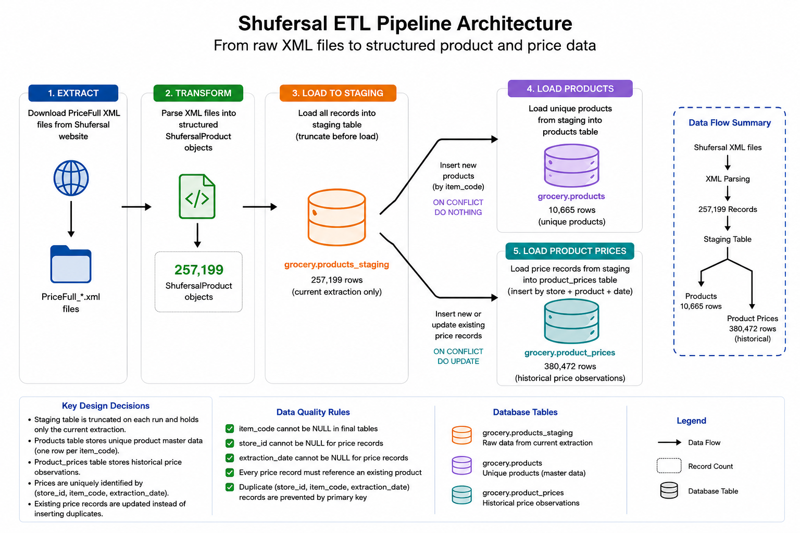
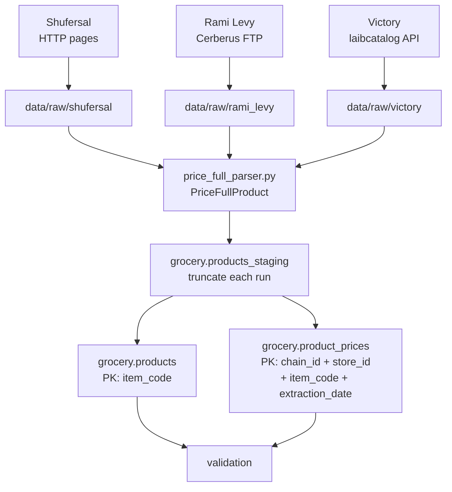

# ETL Pipeline

## Overview

The Smart Grocery Platform ETL extracts official PriceFull supermarket
data from multiple chains, transforms the shared XML schema into
structured product records, and loads the data into PostgreSQL.

High-level flow:

```text
Chain sources
→ chain-specific download
→ shared XML parse (PriceFullProduct)
→ grocery.products_staging
→ grocery.products
→ grocery.product_prices
```



> Note: the image above is still Shufersal-era. Prefer the architecture
> diagram in this document until the PNG is regenerated.


## Architecture Principles

- **Chain-specific:** download / file discovery only
- **Shared:** product model, XML parser, staging table, loaders, validation
- **One process file per chain:**
  - `process_shufersal.py`
  - `process_rami_levy.py`
  - `process_victory.py`


## Chain Extraction Methods

| Chain | Access method | Source | Raw directory | Dev limit |
|-------|---------------|--------|---------------|-----------|
| Shufersal | HTTP (HTML category pages → file links) | `prices.shufersal.co.il` | `data/raw/shufersal` | `max_files` |
| Rami Levy | FTP (Cerberus published prices) | `url.retail.publishedprices.co.il` | `data/raw/rami_levy` | `max_files=3` |
| Victory | HTTP JSON API + file download | `laibcatalog.co.il` | `data/raw/victory` | `max_files=3` |

Each chain stores downloaded PriceFull `.gz` files in its own raw
directory. Existing local files can be skipped on re-download.


## Shared Transform

All supported chains publish PriceFull XML with the same item schema.

- **Model:** `PriceFullProduct` and `FileMetadata` in
  `src/data_extraction/models.py`
- **Parser:** `parse_price_full_files()` in
  `src/data_extraction/price_full_parser.py`

The parser opens each gzipped XML file, reads store/chain metadata from
the file root, and builds one `PriceFullProduct` per `<Item>`.


## Architecture Diagram




## Pipeline Steps

### 1. Extract (per chain)

PriceFull files are downloaded with chain-specific logic and saved under
the matching `data/raw/<chain>/` directory.

Development runs usually limit downloads with `max_files` (default `3`
for Rami Levy and Victory).

### 2. Parse (shared)

Downloaded files are parsed with the shared PriceFull parser into
`PriceFullProduct` objects.

### 3. Optional CSV export

Parsed records can be written to `data/processed/<chain>_products.csv`
using the shared CSV utility.

### 4. Load to Staging

All extracted records are loaded into:

`grocery.products_staging`

The staging table is truncated before each new load.

**Decision:**  
The staging table represents only the current extraction and is not
used for historical storage.

### 5. Validate Staging

`validate_staging()` rejects rows with NULL `item_code`, `store_id`,
`extraction_date`, or `item_price`.

### 6. Load Products

Unique products are loaded from staging into:

`grocery.products`

`item_code` is the primary key.

If a product does not exist, it is inserted. If it already exists, its
metadata is updated using the latest extraction.

**Decision:**  
The `products` table represents the latest known product metadata.
Fields such as product name, manufacturer, quantity, and unit of measure
may change over time, so existing products are updated rather than ignored.

Historical prices are not stored here. Price history is preserved in
`grocery.product_prices`.

### 7. Load Product Prices

Price observations are loaded into:

`grocery.product_prices`

A price record is uniquely identified by the composite primary key:

`chain_id + store_id + item_code + extraction_date`

**Same-day snapshot deduplication:**  
When staging contains multiple snapshots for the same key on the same
day, the loader uses:

```sql
SELECT DISTINCT ON (chain_id, store_id, item_code, extraction_date)
...
ORDER BY chain_id, store_id, item_code, extraction_date, source_file DESC
```

so one row per key is kept (latest `source_file` wins).

If the same key is loaded again later, `ON CONFLICT` updates the existing
row instead of inserting a duplicate.

**Decision:**  
Unlike the staging table, `product_prices` keeps historical observations
so prices can be analyzed over time.

### 8. Validate Product Prices

`validate_product_prices()` checks that every price row references an
existing product (`item_code` foreign key relationship).


## Data Flow

```text
grocery.products_staging
        |
        +----> grocery.products
        |
        +----> grocery.product_prices
```


## Database Tables

### `grocery.products_staging`

Temporary landing table for the current extraction run. Truncated before
each load.

### `grocery.products`

One row per unique product (`item_code`). Holds the latest known product
metadata.

### `grocery.product_prices`

Historical price observations.

Primary key:

`(chain_id, store_id, item_code, extraction_date)`


## Validation

| Check | Purpose |
|-------|---------|
| `validate_staging()` | Fail early on NULL required staging fields |
| `validate_product_prices()` | Fail if any price has no matching product |


## Data Quality Rules

- `item_code` cannot be NULL in final tables.
- `store_id` cannot be NULL for price records.
- `chain_id` cannot be NULL for price records.
- `extraction_date` cannot be NULL for price records.
- Every price record must reference an existing product.
- Duplicate `(chain_id, store_id, item_code, extraction_date)` records are
  prevented by the database primary key.
- Same-day duplicate snapshots are reduced to one row during load
  (`DISTINCT ON` + `source_file DESC`).


## Future Improvements

- Regenerate `images/etl_pipeline.png` for the multi-chain architecture.
- Add latest-per-store selection in chain downloaders.
- Create cross-chain product matching and normalization.
- Add English/Russian product names for dashboard use.
- Improve bulk-loading performance if necessary.
