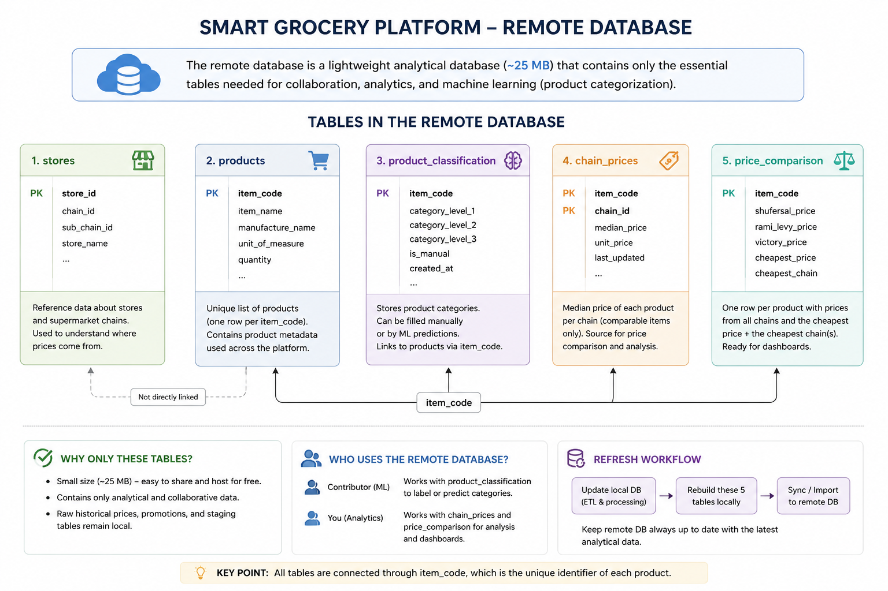

# Remote Database Architecture

## Overview

The Smart Grocery Platform uses two database layers:

- **Local PostgreSQL database** — contains the complete supermarket data collected by the ETL pipeline, including historical prices, promotions, and staging data.
- **Remote PostgreSQL database** — contains a smaller analytical dataset that can be shared between project contributors.

The full local database is approximately **4.1 GB**, while the tables required for collaborative analysis are only approximately **25 MB**.

Instead of uploading the entire database, only the tables needed for **price analysis, product categorization, and future dashboard development** will be stored remotely.

---

## Architecture



The remote database acts as the shared analytical layer of the project.

The local database remains responsible for storing and processing the complete supermarket dataset. After the ETL and analytical transformations are completed locally, the relevant analytical tables are synchronized with the remote database.

---

## Tables Stored Remotely

### `products`

**61,768 rows**

Contains the main product information collected across the supermarket chains.

Examples of available attributes include:

- `item_code`
- `item_name`
- manufacturer information
- quantity
- unit of measure
- product characteristics

`item_code` identifies the product and is used to connect product information with the analytical tables.

This table is also the main input for the **product categorization ML workflow**.

---

### `stores`

**587 rows**

Contains reference information about supermarket stores and chains.

It allows store-level source data to be associated with:

- supermarket chain
- sub-chain
- store

The three chains currently included in the project are:

- Shufersal
- Rami Levy
- Victory

---

### `product_classification`

**Currently 0 rows**

Stores product categories created during the product-classification stage.

The planned workflow is:

```text
products
    ↓
manually labeled sample
    ↓
train classification model
    ↓
evaluate model
    ↓
predict categories for remaining products
    ↓
product_classification
```

This table is included in the remote database so that contributors can work on product categorization without downloading the complete local database.

---

### `chain_prices`

**36,067 rows**

Contains the representative price of each **comparable product within each supermarket chain**.

A product is considered comparable when the same `item_code` appears in at least **two supermarket chains**.

Each row represents:

```text
item_code + chain_id
```

Example:

```text
item_code | chain_id | median_price
----------|----------|-------------
12345     | Shufersal| 10.90
12345     | Rami Levy|  9.90
12345     | Victory  | 11.90
```

Because the same product may have different prices in different stores belonging to one chain, the **median store price** is used as the representative chain price.

The table is generated from the latest store-level price data by:

```text
sql/analysis/create_chain_prices.sql
```

---

### `price_comparison`

**14,816 rows**

This is the main table for exact product price comparison.

Unlike `chain_prices`, which can contain two or three rows for the same product, `price_comparison` contains **one row per comparable product**.

Structure:

```text
item_code
shufersal_price
rami_levy_price
victory_price
cheapest_price
cheapest_chain
```

Example:

```text
item_code | shufersal | rami_levy | victory | cheapest | cheapest_chain
----------|-----------|-----------|---------|----------|----------------------
12345     | 10.90     | 9.90      | 11.90   | 9.90     | Rami Levy
67890     | 8.90      | 8.90      | 10.90   | 8.90     | Shufersal & Rami Levy
```

Products do not have to exist in all three chains. If a product exists in only two chains, the missing chain price is stored as `NULL`.

Ties are preserved explicitly:

```text
Shufersal & Rami Levy
Shufersal & Victory
Rami Levy & Victory
All three
```

The table is generated from `chain_prices` by:

```text
sql/analysis/create_price_comparison.sql
```

---

## Data Flow

The analytical data follows this pipeline:

```text
Raw supermarket files
        ↓
Local ETL
        ↓
Local PostgreSQL database
        ↓
latest_product_prices
        ↓
chain_prices
        ↓
price_comparison
        ↓
Remote PostgreSQL database
```

The remote database therefore contains **processed analytical data**, while the large historical source tables remain local.

---

## What Remains Local?

The following large tables are intentionally **not uploaded** to the remote database:

| Table | Approx. size | Reason |
|---|---:|---|
| `product_prices` | 2,428 MB | Full historical store-level price data |
| `promotion_items` | 1,208 MB | Large promotion-detail dataset |
| `promotions` | 335 MB | Not required for the current analysis stage |
| `promotion_groups` | 118 MB | Not required for the current analysis stage |
| staging tables | small | Used only during local ETL |

These tables can still be used locally when deeper historical or promotion analysis is required.

---

## Why This Architecture?

The goal is to separate **data collection/storage** from **collaborative analysis**.

```text
LOCAL DATABASE
Full data
~4.1 GB

        ↓ transformations

REMOTE DATABASE
Analytical data
~25 MB

        ↓

SQL analysis
ML categorization
Dashboard development
Collaboration
```

This approach provides several advantages:

- Contributors do not need to download several gigabytes of supermarket data.
- The shared database remains small enough for free PostgreSQL hosting.
- Raw and historical data remain available locally.
- Analytical tables can be rebuilt whenever new supermarket data is loaded.
- ML categorization and price analysis can be developed independently on the same shared product dataset.

---

## Refresh Process

When new supermarket data is collected:

```text
1. Download new supermarket files

2. Run the local ETL

3. Update the local PostgreSQL database

4. Rebuild chain_prices

5. Rebuild price_comparison

6. Synchronize the required tables with the remote database
```

This means the remote database is **not the source of truth for raw supermarket data**.

It is the shared analytical database generated from the local data pipeline.

---

## Remote Database Scope

The initial remote database contains:

| Table | Rows | Main use |
|---|---:|---|
| `products` | 61,768 | Product metadata + ML input |
| `stores` | 587 | Store and chain reference |
| `product_classification` | 0 | Manual/ML product categories |
| `chain_prices` | 36,067 | Product × chain representative prices |
| `price_comparison` | 14,816 | Final exact-product price comparison |

**Current total size: approximately 25 MB.**

---

## Current Status

- [x] Load data from Shufersal, Rami Levy, and Victory
- [x] Build local PostgreSQL data model
- [x] Identify products available across multiple chains
- [x] Calculate median product price per chain
- [x] Create `chain_prices`
- [x] Create `price_comparison`
- [x] Implement cheapest-chain and tie logic
- [x] Define which tables should be shared remotely
- [ ] Create remote PostgreSQL database
- [ ] Upload shared tables
- [ ] Configure secure database credentials
- [ ] Give contributor database access
- [ ] Test remote connection from the project
- [ ] Start ML product categorization

---

## Security

Remote database credentials must **never be committed to Git**.

Credentials should be stored using environment variables or a local `.env` file:

```text
DATABASE_HOST=
DATABASE_PORT=
DATABASE_NAME=
DATABASE_USER=
DATABASE_PASSWORD=
```

The `.env` file must remain in `.gitignore`.