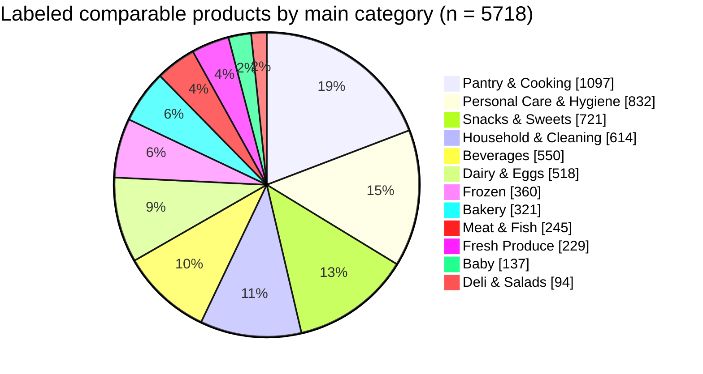
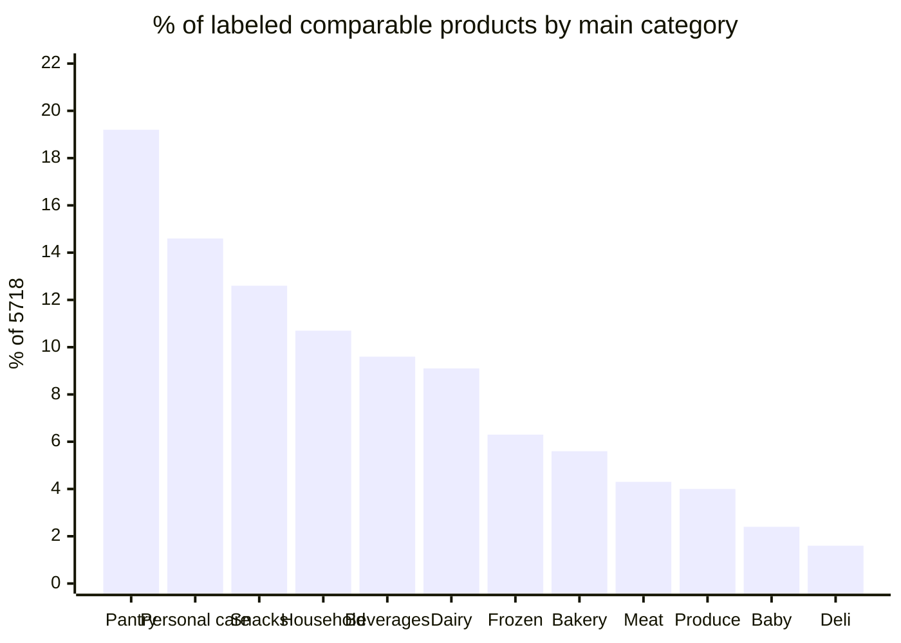
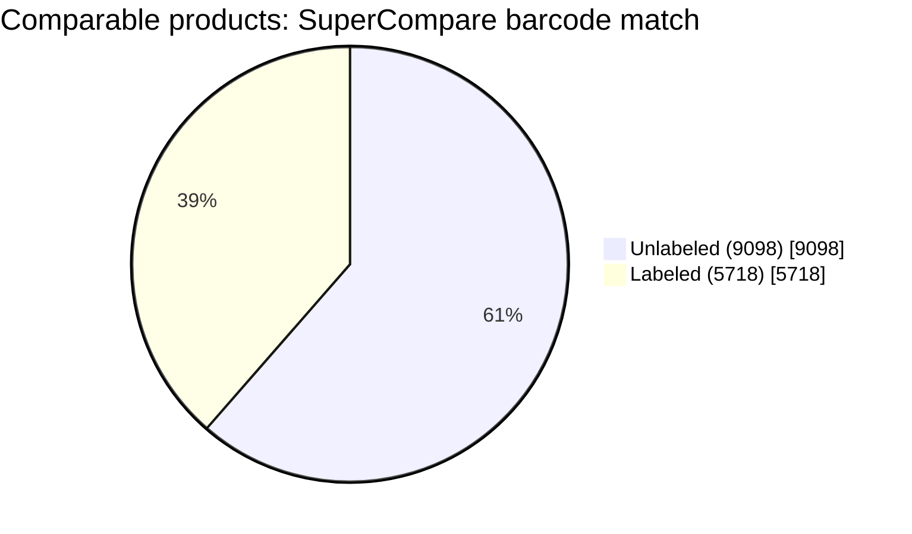
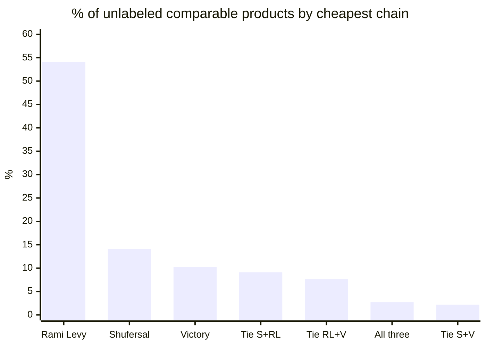
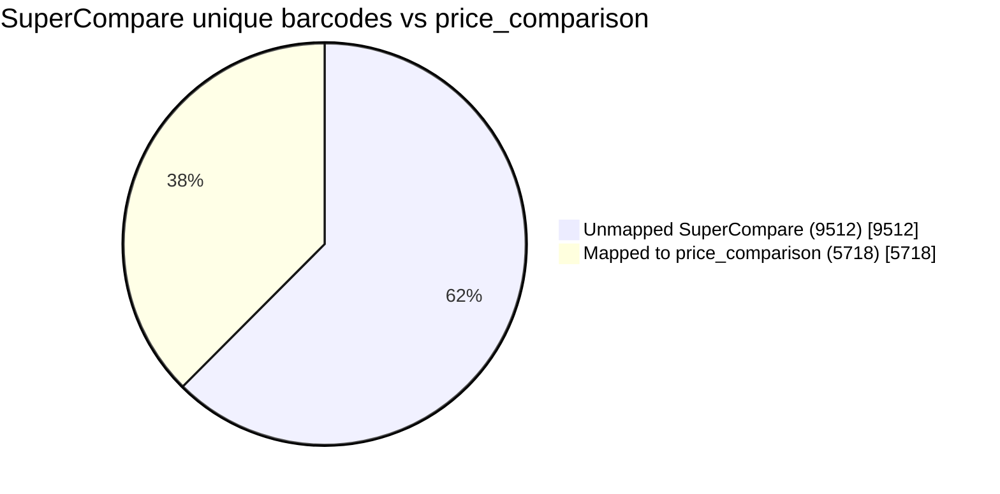
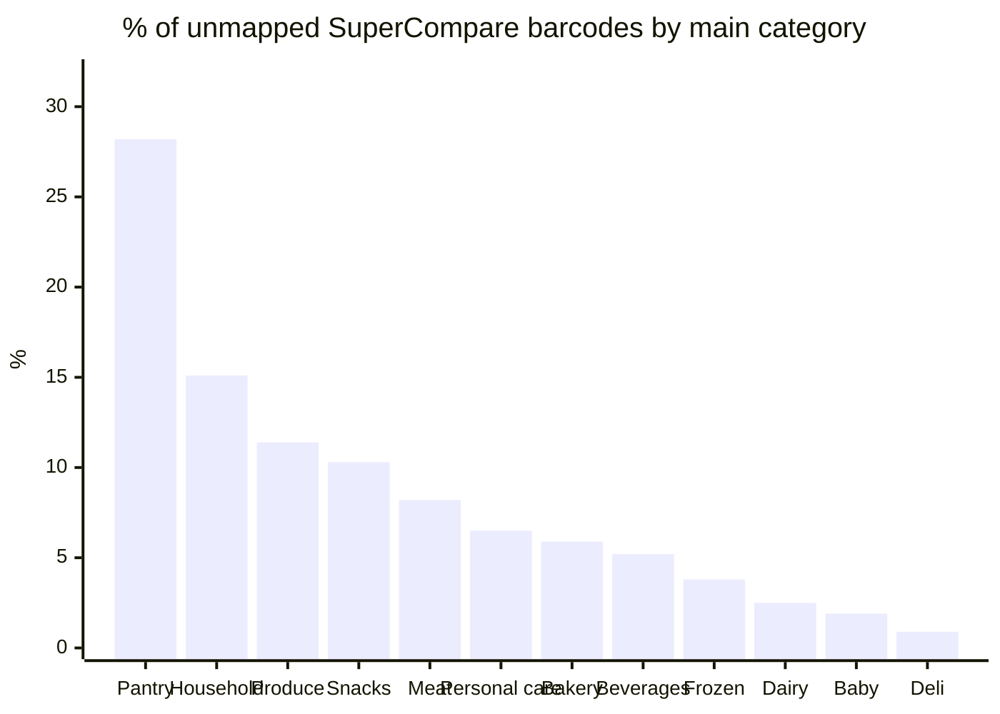

# SuperCompare Product Labeling

Related: [Documentation map](README.md) ·
[ADR 0004](adr/0004-product-categorization-and-training-sample.md) ·
[ADR 0005](adr/0005-resilient-supercompare-crawler.md) ·
[Project roadmap](project-roadmap.md)

## 1. Purpose

The Smart Grocery Platform needs labeled supermarket products so later
analysis can group prices by category (dairy, snacks, cleaning, …), and
so a classifier can be trained for products SuperCompare does not cover.

Instead of manually labeling every comparable product (~14.8k barcodes
in `grocery.price_comparison`), SuperCompare is used as an **external
silver-label** source.

Silver means: useful, cheaper than hand-labeling everything, **not**
guaranteed ground truth. SuperCompare’s own `categoryConfidence` field
includes `ai`, `keyword`, and `manual`.

The crawl writes a local CSV. It does **not** write
`grocery.product_classification`. Promotion into the database is a
separate reviewed step.

## 2. SuperCompare API Discovery

The initial approach was to crawl SuperCompare category pages with `requests` and BeautifulSoup.

Example category page:

```
https://www.supercompare.co.il/he/categories/milk
```

The HTML contained only the first 24 product links.

Using Chrome DevTools → Network → Fetch/XHR showed that the site loads category products from an API endpoint rather than rendering the full catalog in HTML.

Example request:

```
GET /api/groceries/categories/by-slug/milk/products
```

Query parameters:

| Parameter | Example |
|-----------|---------|
| `page`    | `1` |
| `limit`   | `24` |
| `city`    | `tel-aviv` |

The JSON response includes:

- `itemCode`
- `itemName`
- `manufacturerName`
- category information
- pagination metadata (`totalPages`, total product count)

For Milk, the API reported:

- total products: 100
- total pages: 5
- 24 products per page

## 3. Crawler Implementation

The implementation is split into testable objects:

| Object | Responsibility |
|--------|----------------|
| `SuperCompareClient` | HTTP session, taxonomy discovery, response validation, rate limiting, and retries |
| `SuperCompareBatchStore` | Atomic taxonomy/page checkpoints, crawl report, and final CSV export |
| `SuperCompareCrawler` | Category/page orchestration, resume, failure isolation, and run summary |

The client requests one page from
`GET /api/groceries/categories/by-slug/{subcategory}/products`, validates
the external JSON, and converts it immediately to typed
`SuperCompareProduct` records.

| Field | Source |
|-------|--------|
| `item_code` | `itemCode` |
| `product_name` | `itemName` |
| `manufacturer` | `manufacturerName` |
| `main_category` | `slug_to_name(parent slug)` |
| `subcategory` | `slug_to_name(subcategory slug)` |
| `source_url` | `{BASE_URL}/he/product/{itemCode}` |

### Running the crawler

Full taxonomy:

```bash
uv run python -m src.product_classification.supercompare
```

Development slice:

```bash
uv run python -m src.product_classification.supercompare \
  --category dairy-and-eggs \
  --subcategory milk
```

Resume is enabled by default. Use `--no-resume` to refresh selected pages.
Every request is sequential and separated by at least one second. Transient
transport errors, HTTP 429, and selected 5xx responses are retried with
bounded exponential backoff and jitter; `Retry-After` is honored.

Each successful API page is atomically checkpointed under
`data/raw/supercompare/<category>/<subcategory>/page_XXXX.json`. A failed run
keeps those batches and writes `data/processed/supercompare_crawl_report.json`.
The final `data/processed/supercompare_products.csv` is atomically replaced
only after all expected pages are available, so an incomplete run cannot
destroy the last complete export.

## 4. Barcode Matching

SuperCompare `itemCode` is compared with `grocery.products.item_code`.

Matching rule: exact barcode equality

```
SuperCompare.itemCode = grocery.products.item_code
```

No fuzzy product-name matching is used for the join.

Validation of this join lives in `src/product_classification/match_labels.py`:

- `calculate_match_rate()` — unique-barcode intersection with `grocery.products.item_code`, then the same rate overall, by main category, and by subcategory
- `compare_product_names()` — prints database vs SuperCompare names for matched barcodes, including the assigned category path

Both functions load already-crawled products from
`data/processed/supercompare_products.csv`; label analysis no longer starts a
new live crawl.

## 5. Validation Results

Milk barcode match:

| Metric | Value |
|--------|-------|
| SuperCompare Milk products | 100 |
| Matched products in our database | 88 |
| Match rate | 88.0% |

A manual check compared product names for matched barcodes. Names often match exactly, or differ only in spelling, punctuation, abbreviations, or word order while representing the same barcode/product.

Examples:

```
Barcode: 7290107932080
DB:           חלב מועשר3%בקבוק1ל יטבתה
SuperCompare: חלב מועשר3%בקבוק1ל יטבתה

Barcode: 7290003029181
DB:           שוקו בבקבוק 1 ליטר יטבתה
SuperCompare: שוקו יטבתה בבקבוק 1 ליטר

Barcode: 7290000042435
DB:           חלב מפוסטר 1% בקרטון 1ל
SuperCompare: חלב מפוסטר 1% בקרטון 1ל'
```

Some descriptions differ more substantially (for example fat-percentage wording). SuperCompare should not automatically be treated as perfect ground truth.

### Dairy & Eggs slice (milk, cheese, eggs)

After the crawler and matcher were generalized, the join was re-checked on **one parent category** and **three subcategories**, not the full SuperCompare catalog.

| Subcategory | SuperCompare barcodes | Matched in `grocery.products` | Match rate |
|-------------|----------------------|-------------------------------|------------|
| Milk | 100 | 88 | 88.0% |
| Cheese | 315 | 296 | 94.0% |
| Eggs | 14 | 6 | 42.9% |
| **Dairy & Eggs (unique)** | **429** | **390** | **90.9%** |

Milk stayed at 88.0%, which matches the earlier Milk-only test and confirms the generic path did not change that result.

Cheese matched more strongly than Milk. Eggs is a small SuperCompare set (14 products) and a much weaker join against our database.

Assigned labels on matched rows were `Dairy & Eggs / Milk`, `Dairy & Eggs / Cheese`, and `Dairy & Eggs / Eggs` as expected from the tree slice.

## 6. Why Barcode Matching Is Used

Barcode / `item_code` is a stronger identifier than product name.

Product names can differ between supermarket chains because of:

- abbreviations
- spelling
- punctuation
- word order
- manufacturer formatting

Exact barcode matching therefore avoids unnecessary fuzzy name matching for products that share a barcode.

## 7. Important Data Quality Consideration

The SuperCompare API includes a `categoryConfidence` field with values such as:

- `"ai"`
- `"keyword"`
- `"manual"`

SuperCompare classifications may therefore have been produced by different methods. For this project they are silver/external labels that still require validation, not unquestioned ground truth.

Two distinct signals should not be conflated:

1. **Membership in a SuperCompare category endpoint** (for example `/milk/products`)
2. **The `category` / `categoryConfidence` fields** on individual product records

These are not necessarily identical.

This is why product labels are taken from **which subcategory endpoint the crawler called**, plus that endpoint’s parent in the discovered tree — not from the per-product `category` field.

## 8. Taxonomy Discovery and Label Refactor

Milk was only the first slice. The crawler was extended so any SuperCompare parent/subcategory pair can be labeled the same way.

### How taxonomy discovery works

SuperCompare’s public site has two HTML levels:

1. `/he/categories` — parent categories (`dairy-and-eggs`, `meat-and-fish`, …)
2. `/he/categories/{parent}` — subcategory chips (`milk`, `cheese`, `eggs`, …)

Implementation in
`src/product_classification/supercompare/client.py`:

| Method | Role |
|--------|------|
| `discover_taxonomy()` | Scrape parent pages and return typed `CategoryNode` records |
| `fetch_category_page()` | Fetch, validate, and map one product page |
| `slug_to_name()` | Convert `dairy-and-eggs` to `Dairy & Eggs` |

Subcategory parsing applies two extra filters:

- skip the parent slug itself
- keep only chip links (`rounded-full` CSS class), because the page footer also lists every parent category

Products are requested from **subcategory** slugs. That is the more specific SuperCompare class (`/cheese/products`, not `/dairy-and-eggs/products`).

### Decisions

1. **Discover taxonomy from category HTML, not from a products API.** Parent/child slugs are on the category pages. The product API is used only after a slug is known. This kept discovery in the same style as `get_category_slugs()`.

2. **Keep SuperCompare slugs for URLs and API calls.** Display names are derived with `slug_to_name()` (`-` → space, `and` → `&`, then title case). Hebrew link text was not stored, because `SuperCompareProduct` already uses English labels (`Dairy & Eggs`, `Milk`).

3. **Use SuperCompare names as the working taxonomy.** A separate
   project category list and keyword classifier were not kept. Silver
   labels still need validation; they are not ground truth.

4. **Label from tree position, not from `product["category"]`.** The API’s per-product `category` field is a Hebrew parent name and can disagree with the endpoint that returned the row. Membership in `/by-slug/{subcategory}/products` is the labeling rule used here.

5. **The crawler accepts either the full taxonomy or a CLI-selected slice.**
   Milk is not special-cased in the implementation.

6. **`match_labels.py` reads the completed CSV.** It does not mix crawling
   with database comparison. Unique barcodes are used for rates because one
   `itemCode` can appear in more than one SuperCompare endpoint.

7. **Full crawls are resumable.** The crawler persists every successful page,
   retries transient failures politely, and only publishes a complete CSV.

## 9. Current Project Status

Completed:

- [x] Discover SuperCompare category pages
- [x] Identify product barcodes
- [x] Validate barcodes against our database (Dairy & Eggs slice)
- [x] Discover SuperCompare API
- [x] Implement API pagination
- [x] Retrieve all 100 Milk products
- [x] Convert API products to `SuperCompareProduct` objects
- [x] Calculate Milk barcode match rate
- [x] Manually validate sample barcode/name matches
- [x] Discover SuperCompare parent categories and subcategories
- [x] Remove hardcoded Milk category labels
- [x] Label products from the category tree (parent + subcategory slugs)
- [x] Match barcodes for a multi-subcategory slice (Dairy & Eggs: milk, cheese, eggs)
- [x] Report match rate overall and per category/subcategory (partial crawl)
- [x] Add polite retries, structured logs, and page-level checkpoints
- [x] Add crash-safe resume and atomic CSV publication
- [x] Add a module and Cursor launcher
- [x] Run a complete SuperCompare taxonomy crawl (1 September 2026)
- [x] Join SuperCompare barcodes to `grocery.price_comparison`
- [x] Chart labeled category / subcategory distribution

## 9a. Full taxonomy crawl (1 September 2026)

File: `data/processed/supercompare_products.csv`

Columns: `item_code`, `product_name`, `manufacturer`, `main_category`,
`subcategory`, `source_url`.

| Metric | Value |
|--------|------:|
| Rows | 15,616 |
| Unique barcodes (`item_code`) | 15,230 |
| Parent categories | 12 |
| Subcategories | 55 |
| Rows with empty manufacturer | 5,986 |
| Barcodes that appear more than once | 369 |
| Barcodes with **two different** category paths | 0 |

The 369 repeated barcodes are duplicate rows with the **same**
category path, not competing labels. The CSV can still be de-duplicated
on `item_code` before joining.

Rows by parent category:

| Main category | Rows |
|---|---:|
| Pantry & Cooking | 3,800 |
| Household & Cleaning | 2,129 |
| Snacks & Sweets | 1,741 |
| Personal Care & Hygiene | 1,492 |
| Fresh Produce | 1,380 |
| Meat & Fish | 1,132 |
| Beverages | 1,056 |
| Bakery | 889 |
| Dairy & Eggs | 762 |
| Frozen | 729 |
| Baby | 322 |
| Deli & Salads | 184 |

Pantry is dominated by **Spices & Seasonings** (2,174 rows). That slice
will skew “Pantry” analysis if it is treated as one homogeneous class.

Raw checkpoints live under `data/raw/supercompare/<category>/<subcategory>/`.
The discovered tree is `data/raw/supercompare/taxonomy.json`.

This catalog is **SuperCompare’s** product set, not our comparable-product
set. A barcode in the CSV may be missing from `grocery.products`, and a
comparable product in `price_comparison` may be missing from SuperCompare.

Barcode match rates against `grocery.products` were last measured on a
**partial** crawl (see section 5). The comparable-product join is in
section 9b.

## 9b. Labeled comparable distribution (for training-sample size)

This is the same analysis as the Cursor canvas
`labeled-category-distribution.canvas.tsx`. A `.canvas.tsx` file cannot
run inside GitHub Markdown, so the numbers and charts are copied here.

Join rule: exact barcode
`SuperCompare.item_code = grocery.price_comparison.item_code`
after de-duplicating SuperCompare on `item_code`.

Analysis file:
`data/processed/price_comparison_with_categories.csv`

| Metric | Value |
|--------|------:|
| Comparable products (`price_comparison`) | 14,816 |
| Labeled (barcode in SuperCompare) | 5,718 |
| Share of comparable set labeled | **38.6%** |
| Unlabeled comparable products | 9,098 |
| Main categories | 12 |
| Subcategories | 55 |

### Main category share of the 5,718 labeled products





| Main category | Labeled n | % of 5,718 | 70% train n | vs 100–200 target |
|---|---:|---:|---:|---|
| Pantry & Cooking | 1,097 | 19.2% | 768 | Comfortable (over-represented) |
| Personal Care & Hygiene | 832 | 14.6% | 582 | Comfortable |
| Snacks & Sweets | 721 | 12.6% | 505 | Comfortable |
| Household & Cleaning | 614 | 10.7% | 430 | Comfortable |
| Beverages | 550 | 9.6% | 385 | Comfortable |
| Dairy & Eggs | 518 | 9.1% | 363 | Comfortable |
| Frozen | 360 | 6.3% | 252 | Comfortable |
| Bakery | 321 | 5.6% | 225 | Comfortable |
| Meat & Fish | 245 | 4.3% | 172 | Meets 100 floor |
| Fresh Produce | 229 | 4.0% | 160 | Meets 100 floor |
| Baby | 137 | 2.4% | 96 | Meets 100 floor |
| Deli & Salads | 94 | 1.6% | 66 | Below 100 |

### Subcategory share of the 5,718 labeled products

Guideline: **≥100** examples is comfortable for a class; **50–99** can
be reported with care; **&lt;50** should not be a model class.

| Subcategory | n | % of 5,718 | Band |
|---|---:|---:|---|
| Household & Cleaning / Cleaning Products | 398 | 7.0% | ≥100 |
| Pantry & Cooking / Spices & Seasonings | 378 | 6.6% | ≥100 |
| Personal Care & Hygiene / Deodorant & Skincare | 313 | 5.5% | ≥100 |
| Personal Care & Hygiene / Soap & Shampoo | 284 | 5.0% | ≥100 |
| Snacks & Sweets / Salty Snacks | 273 | 4.8% | ≥100 |
| Bakery / Cookies & Cakes | 252 | 4.4% | ≥100 |
| Dairy & Eggs / Cheese | 223 | 3.9% | ≥100 |
| Beverages / Alcohol | 201 | 3.5% | ≥100 |
| Pantry & Cooking / Rice Pasta & Grains | 185 | 3.2% | ≥100 |
| Pantry & Cooking / Canned & Jarred | 179 | 3.1% | ≥100 |
| Dairy & Eggs / Yogurt & Pudding | 170 | 3.0% | ≥100 |
| Personal Care & Hygiene / Oral Care | 164 | 2.9% | ≥100 |
| Snacks & Sweets / Candy & Gum | 155 | 2.7% | ≥100 |
| Beverages / Hot Drinks | 147 | 2.6% | ≥100 |
| Pantry & Cooking / Spreads & Dips | 147 | 2.6% | ≥100 |
| Snacks & Sweets / Chocolate | 132 | 2.3% | ≥100 |
| Frozen / Ice Cream & Desserts | 130 | 2.3% | ≥100 |
| Fresh Produce / Fresh Vegetables | 123 | 2.2% | ≥100 |
| Snacks & Sweets / Nuts & Seeds | 110 | 1.9% | ≥100 |
| Meat & Fish / Deli & Processed Meat | 108 | 1.9% | ≥100 |
| Beverages / Juices | 104 | 1.8% | ≥100 |
| Pantry & Cooking / Breakfast Cereal | 100 | 1.7% | ≥100 |
| Meat & Fish / Fish & Seafood | 87 | 1.5% | 50–99 |
| Beverages / Soft Drinks | 77 | 1.3% | 50–99 |
| Pantry & Cooking / Baking Supplies | 74 | 1.3% | 50–99 |
| Frozen / Frozen Pastry & Pizza | 74 | 1.3% | 50–99 |
| Frozen / Frozen Meals | 72 | 1.3% | 50–99 |
| Household & Cleaning / Laundry | 72 | 1.3% | 50–99 |
| Personal Care & Hygiene / Feminine Care | 71 | 1.2% | 50–99 |
| Dairy & Eggs / Milk | 70 | 1.2% | 50–99 |
| Household & Cleaning / Trash Bags & Wraps | 69 | 1.2% | 50–99 |
| Baby / Baby Food | 65 | 1.1% | 50–99 |
| Deli & Salads / Hummus & Tahini | 60 | 1.0% | 50–99 |
| Fresh Produce / Fresh Herbs | 59 | 1.0% | 50–99 |
| Baby / Baby Care | 58 | 1.0% | 50–99 |
| Frozen / Frozen Vegetables & Fruit | 58 | 1.0% | 50–99 |
| Bakery / Bread | 57 | 1.0% | 50–99 |
| Dairy & Eggs / Cream & Butter | 52 | 0.9% | 50–99 |
| Snacks & Sweets / Cereal & Energy Bars | 51 | 0.9% | 50–99 |
| Fresh Produce / Fresh Fruit | 47 | 0.8% | &lt;50 |
| Household & Cleaning / Pet Food & Supplies | 40 | 0.7% | &lt;50 |
| Meat & Fish / Poultry | 35 | 0.6% | &lt;50 |
| Frozen / Frozen Meat & Poultry | 26 | 0.5% | &lt;50 |
| Household & Cleaning / Paper Products | 26 | 0.5% | &lt;50 |
| Deli & Salads / Packaged Salads | 21 | 0.4% | &lt;50 |
| Beverages / Water | 21 | 0.4% | &lt;50 |
| Pantry & Cooking / Sauces & Condiments | 17 | 0.3% | &lt;50 |
| Pantry & Cooking / Oils & Vinegar | 17 | 0.3% | &lt;50 |
| Meat & Fish / Beef & Lamb | 15 | 0.3% | &lt;50 |
| Baby / Diapers | 14 | 0.2% | &lt;50 |
| Bakery / Pastries | 12 | 0.2% | &lt;50 |
| Deli & Salads / Prepared Foods | 12 | 0.2% | &lt;50 |
| Household & Cleaning / Disposable Tableware | 9 | 0.2% | &lt;50 |
| Dairy & Eggs / Eggs | 3 | 0.1% | &lt;50 |
| Deli & Salads / Dips & Spreads | 1 | 0.0% | &lt;50 |

### Sparse subcategories (under 50 labeled comparable products)

Do not train these as their own model classes. After a 70/15/15 split,
the train set would be even smaller.

| Subcategory | n | % of 5,718 | 70% train n |
|---|---:|---:|---:|
| Fresh Produce / Fresh Fruit | 47 | 0.8% | 33 |
| Household & Cleaning / Pet Food & Supplies | 40 | 0.7% | 28 |
| Meat & Fish / Poultry | 35 | 0.6% | 25 |
| Frozen / Frozen Meat & Poultry | 26 | 0.5% | 18 |
| Household & Cleaning / Paper Products | 26 | 0.5% | 18 |
| Deli & Salads / Packaged Salads | 21 | 0.4% | 15 |
| Beverages / Water | 21 | 0.4% | 15 |
| Pantry & Cooking / Sauces & Condiments | 17 | 0.3% | 12 |
| Pantry & Cooking / Oils & Vinegar | 17 | 0.3% | 12 |
| Meat & Fish / Beef & Lamb | 15 | 0.3% | 11 |
| Baby / Diapers | 14 | 0.2% | 10 |
| Bakery / Pastries | 12 | 0.2% | 8 |
| Deli & Salads / Prepared Foods | 12 | 0.2% | 8 |
| Household & Cleaning / Disposable Tableware | 9 | 0.2% | 6 |
| Dairy & Eggs / Eggs | 3 | 0.1% | 2 |
| Deli & Salads / Dips & Spreads | 1 | 0.0% | 1 |

16 of 55 subcategories are in this sparse set. Merge them into the parent
category or `Other`.

### Manual name check (review sample)

A stratified sample of **104** labeled comparable products is in
`data/processed/category_label_review_sample.csv` (5 per main category,
plus extra sparse/weak rows). Compare `item_name` (our database) to
`category` / `subcategory`. Open `source_url` on SuperCompare if unsure.

Likely mislabels in that sample:

| Barcode | Our product name | SuperCompare category | Problem |
|---|---|---|---|
| 7290013083999 | חול קריסטלי לחתולים | Beverages / Water | Cat litter |
| 7290119372607 | פלטינום נטול קפאין | Dairy & Eggs / Eggs | Coffee |
| 7290013268938 | סבון אסלה | Personal Care / Soap & Shampoo | Toilet cleaner |
| 5601217129420 | דף לוכד צבע לכביסה | Baby / Baby Care | Laundry sheet |
| 50000032648 | פנסיפיסט פרוסות עוף | Meat & Fish / Beef & Lamb | Pet food |
| 50000426447 | פנסיפיסט נתחי הודו | Meat & Fish / Poultry | Pet food |
| 7290109924137 | קפסולות למדיח | Household / Laundry | Dishwasher pods |
| 7290013116024 | פריכיות כוסמת | Bakery / Cookies & Cakes | Crispbread, not cookies |

Hummus, salads, dairy (except the coffee-in-Eggs row), herbs, ice cream,
and real spices looked correctly labeled. Fresh Produce often includes
**dried** fruit; that is SuperCompare’s taxonomy, not a random mismatch.

Do not set `include_in_analysis = false` for a whole subcategory just
because SuperCompare coverage was low. Herbs, spices, beef, and real
eggs stay in analysis when the name matches. Use `false` only for
barcodes that are clearly in the wrong class (pet food, litter, coffee
labeled as eggs, toilet cleaner labeled as shampoo).

### What sample size to use

ADR 0004 asked for about **2,000–5,000** labeled products overall and
**100–200 per main category**. SuperCompare silver labels already give
**5,718** comparable products. Eleven of twelve main categories meet the
100-example floor. Only **Deli & Salads** is short (94).

- First model: **12 main categories**, stratified **70 / 15 / 15**
  (~4,003 / 858 / 857). No large extra hand-labeling round is required.
- Do **not** train a 55-way subcategory model first. Merge slices under
  50 into the parent or `Other`.
- Extra labels, if any, belong on Deli, Eggs, Water, Pastries, and Beef
  — not on Cleaning or Spices.
- For category-level price charts you can skip a model and use these
  5,718 labeled comparable rows. `include_in_analysis` is false only for
  a short denylist of known mislabels, not for entire subcategories.

## 9c. Unlabeled comparable products (the ~9k)

These **9,098** products are in `grocery.price_comparison` but have **no
SuperCompare category**. There is no honest category pie for them until
a classifier (or another label source) assigns one.

| Metric | Value |
|--------|------:|
| Unlabeled comparable products | 9,098 |
| Share of `price_comparison` | 61.4% |
| In exactly two chains | 5,479 (60.2%) |
| In all three chains | 3,619 (39.8%) |



Cheapest chain among the unlabeled 9,098:

| Cheapest chain | n | % of 9,098 |
|---|---:|---:|
| Rami Levy | 4,920 | 54.1% |
| Shufersal | 1,287 | 14.1% |
| Victory | 930 | 10.2% |
| Shufersal & Rami Levy | 824 | 9.1% |
| Rami Levy & Victory | 694 | 7.6% |
| All three | 247 | 2.7% |
| Shufersal & Victory | 196 | 2.2% |



Examples with no SuperCompare barcode: KitKat, Kinder Surprise, Werther’s.
They are still snacks — SuperCompare simply did not cover that barcode.

### Manufacturer completeness (classifier feature check)

Use `grocery.products.manufacture_name`, not SuperCompare’s manufacturer
column. SuperCompare manufacturer is filled for **95.3%** of the 5,718
labeled rows and is empty for unlabeled rows by construction, so it
cannot be a model feature for the 9,098.

| Population | n | Manufacturer present | Missing / empty | Unique names |
|---|---:|---:|---:|---:|
| Labeled comparable | 5,718 | 5,222 (**91.3%**) | 496 (8.7%) | 1,075 |
| Unlabeled comparable | 9,098 | 8,000 (**87.9%**) | 1,098 (12.1%) | 1,703 |

Gap: **−3.4 percentage points**. Completeness is similar enough to keep
manufacturer as a classifier input. Handle missing values (do not drop
rows or require the field). Do not train on SuperCompare manufacturer
and then score unlabeled products that never have it.

## 9d. SuperCompare barcodes that did not map to `price_comparison`

This is the **opposite** unmatched set from section 9c.

```text
SuperCompare unique barcodes          15,230
        │
        ├── in price_comparison       5,718   labeled comparable (section 9b)
        └── not in price_comparison   9,512   SuperCompare-only (this section)

price_comparison                      14,816
        │
        ├── SuperCompare barcode      5,718   same 5,718
        └── no SuperCompare barcode   9,098   unlabeled comparable (section 9c)
```

| | Count | Share |
|---|---:|---:|
| Unique SuperCompare barcodes | 15,230 | 100% |
| Mapped to `grocery.price_comparison` | 5,718 | 37.5% |
| **In SuperCompare, not in our comparison table** | **9,512** | **62.5%** |

These 9,512 rows **do** have SuperCompare categories. They did not join
because the barcode is not among products sold in at least two of
Shufersal, Rami Levy, and Victory (or we never loaded that barcode).
They are not the training leftovers; the leftovers are the 9,098 in
section 9c.



### Category mix of unmapped SuperCompare barcodes

| Main category | Unmapped n | % of 9,512 |
|---|---:|---:|
| Pantry & Cooking | 2,683 | 28.2% |
| Household & Cleaning | 1,434 | 15.1% |
| Fresh Produce | 1,086 | 11.4% |
| Snacks & Sweets | 980 | 10.3% |
| Meat & Fish | 780 | 8.2% |
| Personal Care & Hygiene | 623 | 6.5% |
| Bakery | 560 | 5.9% |
| Beverages | 495 | 5.2% |
| Frozen | 365 | 3.8% |
| Dairy & Eggs | 238 | 2.5% |
| Baby | 180 | 1.9% |
| Deli & Salads | 88 | 0.9% |



**Spices & Seasonings** alone is **1,792** unmapped barcodes (**18.8%**
of this set). Other large subcategories: Cleaning Products (610), Fresh
Vegetables (561), Trash Bags & Wraps (442), Fresh Fruit (427).

Do not treat SuperCompare’s 9,512 unmapped products as a hole in
*our* comparison dataset. They are SuperCompare items we cannot use
for cheapest-chain analysis. The hole to fill with a model is the
9,098 comparable products with no SuperCompare barcode.

## 10. Next Steps

Done in this phase:

- [x] Deduplicate SuperCompare on `item_code` and join to
  `grocery.price_comparison`
- [x] Write `data/processed/price_comparison_with_categories.csv`
- [x] Measure labeled share of the comparable set (38.6%)
- [x] Chart category / subcategory distribution for training-sample size
- [x] Separate unlabeled comparable products (9,098) from unmapped SuperCompare barcodes (9,512)

Still planned:

1. Promote reviewed barcode → category mappings to remote
   `grocery.product_classification`.
2. Create a labeled train/validation/test split if unlabeled leftovers
   still need a model.
3. Train and evaluate a simple **main-category** classifier for the
   ~9,098 products without a SuperCompare label.
4. Use categories in category-level price analysis (roadmap steps 3–8).
